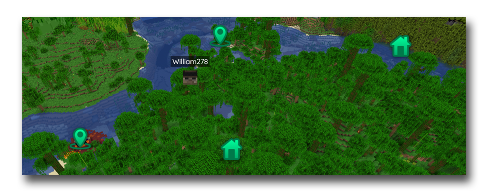
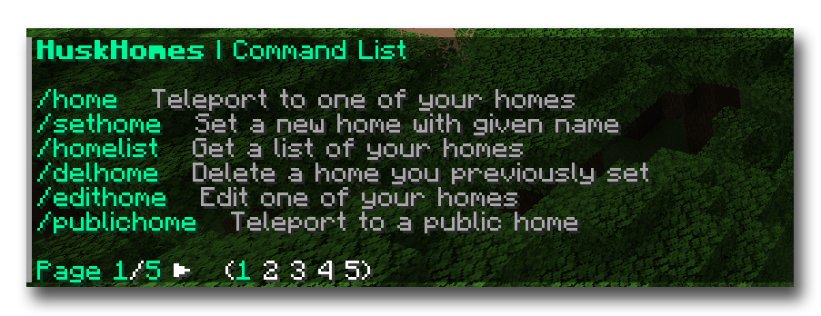
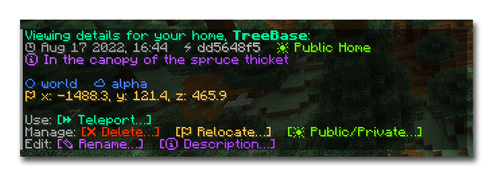
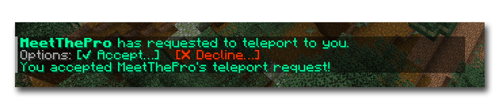

# [](https://github.com/WiIIiam278/HuskHomes2)
[](https://github.com/WiIIiam278/HuskHomes2/actions/workflows/java_ci.yml)
[](https://jitpack.io/#net.william278/HuskHomes2)
[](https://discord.gg/tVYhJfyDWG)

[Documentation, Guides & API](https://william278.net/docs/huskhomes/) · [Resource Page](https://www.spigotmc.org/resources/huskhomes.83767/) · [Bug Reports](https://github.com/WiIIiam278/HuskHomes2/issues)

**HuskHomes** is a powerful, intuitive and flexible teleportation plugin for Spigot-based Minecraft servers. The plugin supports a wide array of features; from teleporting between players, teleport requests, public and private homes, warps, random teleporting and more. 

All of this is supported on standalone and cross-server setups; players can set home and teleport on and between multiple servers on a proxy network.

## Features

- Supports a wide array of commands players will understand in seconds.
- Simple and intuitive interface; no clunky GUIs! Instead, the plugin provides a robust clickable chat menu system to view and manage homes and warps.
- Supports teleporting to homes and players cross-server on a proxy network.
- Teleport requests (/tpa; /tpahere; /tpaccept; /tpdeny), supported through multiple servers

- Smart random teleport system to let your players get out into the wild quickly and safely
- Has a /back command to let players return to their previous position, or where they died if they have the right permissions
- Integrate your economy by configuring costs for teleporting, setting homes and random teleporting.
- Fully customisable plugin messages, with multi-language and custom color support via MineDown formatting
- Hooks up with your server's map (Dynmap, BlueMap) and analytics plugin (Plan)

- Set warps for your server with the /setwarp and /warp commands
- Set a spawn location with /setspawn and let players return to it with /spawn
- Perfect for a small server with friends, or a large multiple-server network!

### Commands
Too many? Don't worry; you can easily disable the commands you don't need.
- /home, /sethome, /edithome, /homelist
- /publichome, /publichomelist
- /warp, /setwarp, /editwarp, /warplist
- /tpa, /tpahere, /tpaccept, /tpdeny
- /tp, /tphere, /tpall, /tpaall
- /spawn, /rtp, /back, /huskhomes 
- [Full list & permissions](https://william278.net/docs/huskhomes/Commands)




### Add-ons
* [HuskHomesPlaceholders](https://github.com/WiIIiam278/HuskHomesPlaceholders) (A PlaceholderAPI expansion for HuskHomes)
* [HuskHomesGUI](https://github.com/WiIIiam278/HuskHomesGUI) (GUI menus for viewing homes and warps)

## Setup
### Requirements
* A Spigot-based Minecraft server (1.16.5 or higher, Java 16+)
* (For proxy network support) A proxy server (1.16+) and MySQL v8.0+ database
* (For optional redis support) A Redis database v5.0+

### Instructions
1. Place the plugin jar file in the `/plugins/` directory of your server(s).
2. Restart your server(s) to let HuskHomes generate its config file.
3. Configure the plugin to your liking by editing the config file.
    * If you are using a proxy network, you will need to configure the plugin on each server, including specifying database credentials and enabling the `cross_server` mode.
4. Turn on your server(s) and enjoy!

## Building
To build HuskHomes, simply run the following in the root of the repository:
```
./gradlew clean build
```

## License
HuskHomes is licensed under [Apache-2.0 License](https://github.com/WiIIiam278/HuskHomes2/blob/master/LICENSE).

## Translation
Translations of the plugin locales are welcome to help make the plugin more accessible. Please submit a pull request with your translations as a `.yml` file.

- [Locales Directory](https://github.com/WiIIiam278/HuskHomes2/tree/master/common/src/main/resources/locales)
- [English Locales](https://github.com/WiIIiam278/HuskHomes2/tree/master/common/src/main/resources/locales/en-gb.yml)

## bStats
This plugin uses bStats to provide me with metrics about its usage:
- [bStats Metrics](https://bstats.org/plugin/bukkit/HuskHomes/8430)

You can turn metric collection off by navigating to `~/plugins/bStats/config.yml` and editing the config to disable plugin metrics.

## Links
- [Documentation, Guides & API](https://william278.net/docs/huskhomes/)
- [Resource Page](https://www.spigotmc.org/resources/huskhomes.83767/)
- [Bug Reports](https://github.com/WiIIiam278/HuskHomes2/issues)
- [Discord Support](https://discord.gg/tVYhJfyDWG)


---
&copy; [William278](https://william278.net/), 2022. Licensed under the Apache-2.0 License.
